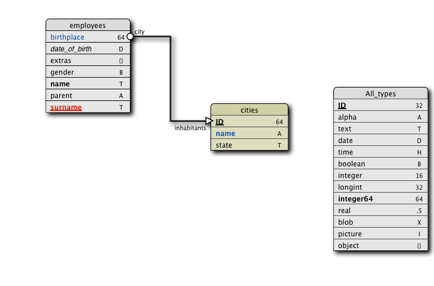

# drawStructure

Generate an image of the structure

This is a rewriting of the drawing method of the structure of the SVG Goodies database with some enhancements:

*  Respect the field order
*  display the relation names

______

______
### Sample methods:

* structurePictureToPasteboard 
* structurePictureAsPDF
* structurePictureToFile

